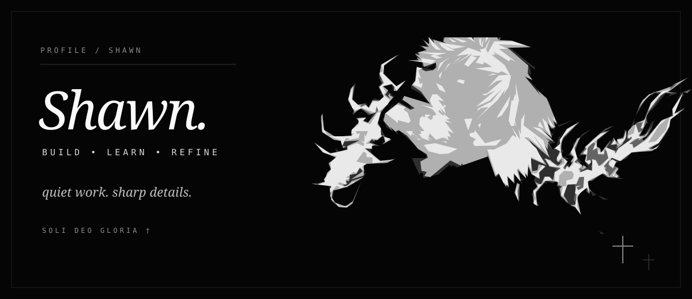

<!-- made to feel like me, not like a template -->

<p align="center">
  
</p>

<br>

```text
$ whoami

Shawn.
I build things, break them, rebuild them, and keep going until they feel right.
```

### `what i'm into`

web apps / automation / interfaces / AI / weird ideas that turn into real projects

I care a lot about the small stuff — spacing, speed, structure, how something feels to use, and whether it actually looks finished.

### `what i use`

`TypeScript` &nbsp; `JavaScript` &nbsp; `Node.js` &nbsp; `React` &nbsp; `Next.js`

`HTML` &nbsp; `CSS` &nbsp; `Git` &nbsp; `Docker` &nbsp; `Supabase` &nbsp; `Vercel`

### `current state`

```text
learning        ████████████████████  never stops
building        █████████████████░░░  always something
perfectionism   ███████████████████░  probably too much
sleep           ██████░░░░░░░░░░░░░░  questionable
```

<p align="center">
  
</p>

<p align="center">
  <samp>† soli deo gloria</samp>
  <br>
  <sub>“Whatever you do, do it all for the glory of God.” — 1 Corinthians 10:31</sub>
</p>

<br>

<p align="right"><sub>Shawn / 2026</sub></p>
